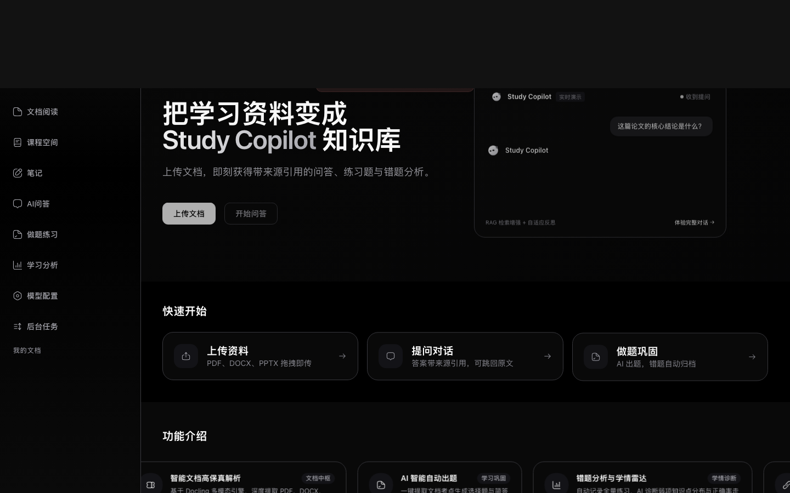
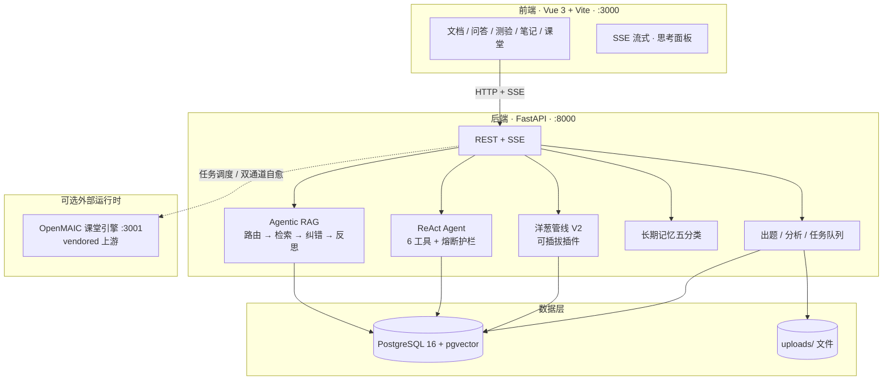
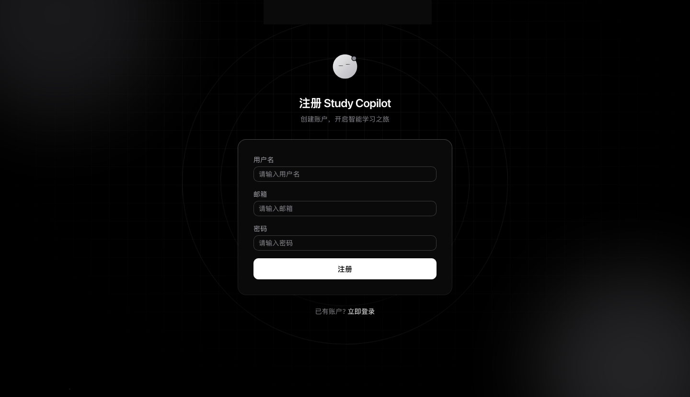

<div align="center">

# Study Copilot

**把学习资料变成可检索、可追问、可练习的 AI 知识库**

[](https://www.python.org/)
[](https://fastapi.tiangolo.com/)
[](https://vuejs.org/)
[](https://www.postgresql.org/)
[](https://github.com/pgvector/pgvector)
[](LICENSE)

[快速开始](#-快速开始) · [功能](#-核心能力) · [架构](#-架构) · [文档](docs/0-START-HERE/index.md) · [第三方归属](#-第三方与归属)

</div>

---

## 这是什么

Study Copilot 是一个 **本地优先、可自托管** 的 AI 学习助手：

上传 PDF / DOCX / PPTX / TXT / Markdown → **Agentic RAG** 带来源引用问答 → 自动出题与错题分析 → 笔记、长期记忆与多角色研讨。

适合学生备考、教师备课、企业文档培训与个人知识库。

<p align="center">
  
</p>

---

## 核心能力

<table>
<tr>
<td width="50%" valign="top">

### Agentic RAG 问答
意图路由 · 自适应检索 · 纠错重试 · 答案自我反思 · **来源卡片**（正文 `[来源N]` 与卡片联动高亮）

### 深度研究 Agent
ReAct 循环 + 6 只读工具；多层熔断（迭代 / Token 预算 / 重复调用 / 新颖度）

### 流式思考透明化
SSE 逐 token 输出 · 原生 CoT · Agentic 决策流水线 · 三层折叠面板

</td>
<td width="50%" valign="top">

### 混合检索
pgvector 语义 + 全文检索 + **RRF 融合**（单条 SQL）；自适应分块链

### 长期记忆
画像 / 偏好 / 事实 / 任务 / 兴趣五分类 · pending 确认隔离 · CJK 词法召回

### 学习闭环
自动出题 · 错题本 · 学情分析 · 课程空间 · 多角色研讨；笔记语义搜索当前基于本地 FAISS

</td>
</tr>
</table>

| 还有 | 说明 |
|------|------|
| 多 Provider LLM | OpenRouter / OpenAI / Anthropic / Gemini / 自定义端点；API Key Fernet 加密 |
| 洋葱聊天管线 | 插件化 Pipeline，`PIPELINE_V2_ENABLED` 双轨灰度（默认关闭） |
| 任务队列 | 文档解析 / 测验异步化，pending 落库 + 看门狗，重启可恢复 |
| 可观测 | X-Trace-ID · 结构化日志 · 可选 Langfuse |
| 互动课堂 | 集成 [OpenMAIC](https://github.com/THU-MAIC/OpenMAIC) 引擎（vendored），见 [归属说明](#-第三方与归属) |

---

## 架构



> 详细模块说明见 [backend/CLAUDE.md](backend/CLAUDE.md)、[frontend/CLAUDE.md](frontend/CLAUDE.md)、[docs/2-ARCHITECTURE](docs/2-ARCHITECTURE/index.md)。

---

## 快速开始

### 方式一：本地开发（推荐，当前可跑通）

前置：Python **3.11+** · Node **18+** · PostgreSQL **16+**（需 pgvector 扩展）

```bash
git clone git@github.com:141w/Study-copilot.git
cd Study-copilot
```

**1. 数据库**

```bash
# macOS 示例
brew install postgresql@16 && brew services start postgresql@16
psql postgres -c "CREATE DATABASE study_copilot;"
psql postgres -c "CREATE USER study_user WITH PASSWORD 'study123';"
psql postgres -c "GRANT ALL PRIVILEGES ON DATABASE study_copilot TO study_user;"
psql study_copilot -c "GRANT ALL ON SCHEMA public TO study_user;"
psql study_copilot -c "CREATE EXTENSION IF NOT EXISTS vector;"
```

**2. 后端 `:8000`**

```bash
cd backend
python3 -m venv .venv && source .venv/bin/activate
pip install -e ".[dev]"
cp .env.example .env
# 编辑 backend/.env：OPENAI_API_KEY、DATABASE_URL、JWT_SECRET_KEY、ENCRYPTION_KEY 等
alembic upgrade head
python run.py          # http://localhost:8000
```

**3. 前端 `:3000`（另开终端）**

```bash
cd frontend
npm install
npm run dev            # http://localhost:3000
```

**4.（可选）课堂引擎 `:3001`**

```bash
cd classroom
cp .env.example .env.local
pnpm dev -- -p 3001
```

更完整说明见 [docs/1-INSTALLATION](docs/1-INSTALLATION/index.md)。

### 方式二：Docker Compose

```bash
cp .env.example .env                 # 根目录：POSTGRES_PASSWORD / ENCRYPTION_KEY / JWT_SECRET_KEY / OPENAI_*
cp backend/.env.example backend/.env # compose 的 env_file 还需要这一份
make build && make up                # 或 docker compose up -d
# 应用: http://127.0.0.1  ·  API: /api/docs  ·  健康检查: /health
```

生成密钥：

```bash
python -c "from cryptography.fernet import Fernet; print(Fernet.generate_key().decode())"
python -c "import secrets; print(secrets.token_urlsafe(32))"
```

> **已知问题**：`backend/Dockerfile` 前端构建阶段从仓库根目录 `COPY package*.json`（根 `package.json` 无 dependencies），`npm ci` / `npm run build` 当前会失败。Docker 路径需先修好该 COPY 上下文后再作为一键部署推荐；**日常开发请用方式一**。

---

## 界面预览

<table>
<tr>
<td align="center" width="50%">
<br/>
<sub>首页 · 知识库入口与快速上手</sub>
</td>
<td align="center" width="50%">
<br/>
<sub>账号体系 · JWT 访问 / 刷新令牌</sub>
</td>
</tr>
</table>

> 问答流式、深度研究折叠面板、多角色研讨等界面需启动后端并登录后体验；后续可在 `docs/assets/` 补充更多真机截图。

---

## 仓库结构

```text
Study-copilot/
├── backend/          # FastAPI · RAG / Agent / 记忆 / 任务队列
├── frontend/         # Vue 3 + Vite + Pinia + Tailwind
├── classroom/        # OpenMAIC 课堂引擎（vendored，非自研，见下）
├── docs/             # 0–6 编号文档 + assets + archive/plans（历史方案稿）
├── scripts/          # 冒烟与辅助脚本
└── docker-compose.yml
```

---

## 开发与测试

```bash
# 后端：约 55 个测试文件 / 634 个测试函数，覆盖率门禁 ≥65%
cd backend && pytest tests/ -v

# 前端：约 298 用例（含 bot 引擎）
cd frontend && npx vitest run && npx vue-tsc --noEmit
```

| 质量门禁 | 工具 |
|----------|------|
| 测试 + 覆盖率 | pytest · `--cov-fail-under=65` |
| 类型 | mypy（渐进棘轮）· vue-tsc |
| Lint | ruff · ESLint（**注意**：CI 里 ruff 目前带 `|| true`，本地门禁以命令为准） |
| 迁移 | Alembic（单 head） |

指南：[docs/4-DEVELOPMENT](docs/4-DEVELOPMENT/index.md) · [testing.md](docs/4-DEVELOPMENT/testing.md)

---

## 文档导航

| 文档 | 内容 |
|------|------|
| [快速上手](docs/0-START-HERE/index.md) | 项目概览 |
| [安装](docs/1-INSTALLATION/index.md) | 详细部署步骤 |
| [架构](docs/2-ARCHITECTURE/index.md) | 系统与数据流 |
| [API](docs/3-API-REFERENCE/index.md) | 接口参考 |
| [开发](docs/4-DEVELOPMENT/index.md) | 规范与工作流 |
| [课堂集成](docs/6-INTEGRATION/ai-classroom-engine.md) | OpenMAIC 集成架构 |
| [历史方案稿](docs/archive/plans/README.md) | 已归档的演进计划（非现行承诺） |

---

## 第三方与归属

本仓库包含两类 **非本项目原创** 的代码，请勿描述为 Study Copilot 自研：

1. **`classroom/` — [THU-MAIC/OpenMAIC](https://github.com/THU-MAIC/OpenMAIC)**  
   整体 vendored（约 2000+ 文件 / 40 万+ 行），基线与升级见 [`classroom/VENDORED.md`](classroom/VENDORED.md)。  
   **自研部分**是集成层：`classroom_service.py` / `classroom_api.py`、前端桥接、双通道自愈轮询、契约测试与上游漂移哨兵。

2. **Agentic 架构参考 — [TencentCloudADP/WeKnora](https://github.com/TencentCloudADP/WeKnora)**  
   洋葱管线 / ReAct Agent / 长期记忆 / 自适应分块等设计在本仓库以 **Python 重写**（约 3k 行），非 Go 源码拷贝。

### 致谢

[OpenMAIC](https://github.com/THU-MAIC/OpenMAIC) · [WeKnora](https://github.com/TencentCloudADP/WeKnora) · [FastAPI](https://fastapi.tiangolo.com/) · [Vue.js](https://vuejs.org/) · [Docling](https://github.com/IBM/docling) · [pgvector](https://github.com/pgvector/pgvector) · [sentence-transformers](https://sbert.net/) · [TailwindCSS](https://tailwindcss.com/)

---

## 许可证

[MIT License](LICENSE)
