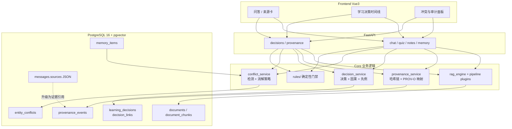

# Semantica 能力融入 Study Copilot — 技术设计文档

| | |
|---|---|
| 状态 | Draft（待评审） |
| 日期 | 2026-09-24 |
| 参考 | [semantica-agi/semantica](https://github.com/semantica-agi/semantica) v0.7.0（本地镜像 `semantica-explore/`） |
| 范围 | 后端 `backend/app/` 为主，前端仅涉及来源卡/审计 UI 的增量 |

---

## 1. 背景与问题

Study Copilot 当前的学习链路是：

```
文档 → 分块 → pgvector 检索 → Agentic RAG → 带 [来源N] 的回答 → 消息落库
```

这条链路能回答「相似的内容是什么」，但回答不了学习场景里更关键的三类问题：

| 问题 | 现状 | 缺口 |
|---|---|---|
| 「这个结论依据哪一句？」 | `messages.sources` 存 chunk 快照 | 无 chunk 级血缘、无防篡改、改文档后无法回放 |
| 「为什么推荐这条学习路径？」 | 路由/策略选择只进 Langfuse trace | 决策不是一等对象，无法查询先例与因果链 |
| 「多文档冲突怎么办？」 | 后检索覆盖或静默拼接 | 无冲突检测、无可信度分级 |

Semantica 的核心贡献不是「又一个 RAG」，而是把 **上下文图 + 决策记录 + PROV-O 溯源 + 确定性规则** 做成可组合的基础设施。本文定义：**从 Semantica 吸收哪些设计、如何嵌进现有 FastAPI + Vue3 架构、分几期落地**。

---

## 2. 目标 / 非目标

### 2.1 目标

1. **可审计引用**：回答中的 `[来源N]` 可回溯到 `document_id / chunk_id / page / 抽取时刻 / 内容哈希`，且证据不可静默篡改。
2. **学习决策一等公民**：测验作答、纠错采纳、学习路径选择、AI 答案采纳可查询、可连因果、可找先例。
3. **冲突可见**：多文档/笔记/记忆对同一事实给出不同说法时标记冲突，而非后写覆盖。
4. **确定性门禁**：复习计划、测验生成、记忆注入等不必过 LLM 的规则用可解释规则层表达。
5. **零破坏演进**：不替换现有 RAG / Agent / 洋葱管线；以旁路服务 + 插件点接入，`PIPELINE_V2_ENABLED` 等开关继续有效。

### 2.2 非目标

- **不引入 Semantica 整包依赖**（21 万行、默认内存图、部分模块半成品）。仅吸收设计；必要时只参考 `provenance/` 的 PROV-O 映射与哈希链算法。
- **不解释 LLM 内部推理**。只审计「喂进去的上下文 / 产出的决策 / 溯源链」。
- **不引入 Neo4j / RDF 三元组库**作为强制存储。图关系落在 PostgreSQL 关联表；导出时再映射 PROV-O。
- **不重写** 文档解析、向量检索、Agent 工具层。

---

## 3. 能力映射（Semantica → Study Copilot）

| Semantica 能力 | 源码锚点 | 融入方式 | 落到 Study Copilot 的哪里 |
|---|---|---|---|
| PROV-O 溯源 + SHA-256 哈希链 | `provenance/schemas.py:37` `integrity.py:27` | **吸收算法** | 新表 `provenance_events`；写在 chunk 落库与答案落库路径 |
| 决策一等公民 `record_decision` / 因果边 | `context/context_graph.py:4370` `:3888` | **吸收模型** | 新表 `learning_decisions` + `decision_links` |
| 因果链 / 影响面 / 先例检索 | `trace_decision_chain` `:5638` | **吸收查询语义** | `decision_service`；API `/api/decisions/*` |
| 双时态（valid_time / recorded_at） | `kg/temporal_model.py:28` | **吸收字段** | 证据与决策统一双时间戳 |
| 冲突检测 + 7 种消解策略 | `conflicts/conflict_resolver.py:128` | **吸收策略** | 文档合并 / 笔记与记忆对齐时调用 |
| 实体消歧（Union-Find + 模糊匹配） | `deduplication/duplicate_detector.py:75` | **轻量吸收** | 知识点实体归一（后续知识点图谱） |
| PolicyEngine / Rete 确定性规则 | `context/policy_engine.py:80` `reasoning/rete_engine.py:304` | **概念吸收** | `rules/` 目录：复习间隔、测验难度门禁、记忆注入条件 |
| EntityAware / RelationAware chunking | `split/kg_chunkers.py:62` | **对照增强** | 扩展现有 `chunk_strategy.py`（WeKnora M2 已有骨架） |
| GDPR / ErasureCoordinator | `context/erasure.py:143` | **吸收 Receipt 模式** | 账号注销/文档硬删时的跨表清理回执 |
| AgentContext 门面 | `context/agent_context.py:91` | **概念吸收** | 统一「会话上下文组装」入口（可选，后期） |
| GraphBuilder 全家桶 / RDF 导出 / Explorer | `kg/` `export/` `explorer/` | **不引入** | 过重；学习场景用 PostgreSQL + 现有前端即可 |
| SPARQLReasoner / AbductiveReasoner | `reasoning/sparql_reasoner.py` | **不引入** | 源码自认 placeholder / 模板级 |

**结论：策略是「模式吸收 + 最小自研」，不是 `pip install semantica`。**

---

## 4. 目标架构



与现有架构的关系：

- **不替换** `rag_engine` / `agent/engine.py` / `pipeline/`，只在「证据产出点」与「决策产出点」挂钩子。
- **不替换** Langfuse（M1）：Langfuse 观测执行过程；Provenance/Decision 审计**业务事实**。二者互补。
- **不替换** 五分类长期记忆（M3）：记忆条目升级为「可冲突、可溯源」的证据源。

---

## 5. 数据模型设计

全部新表走 Alembic，命名与现有一致（UUID PK、`_utcnow_naive`）。

### 5.1 证据与溯源 `provenance_events`

> 参考 Semantica `ProvenanceEntry` + `integrity.py` 哈希链。

```sql
CREATE TABLE provenance_events (
    id              TEXT PRIMARY KEY,
    user_id         TEXT NOT NULL REFERENCES users(id) ON DELETE CASCADE,
    entity_type     TEXT NOT NULL,   -- chunk | message | note | memory | quiz | decision
    entity_id       TEXT NOT NULL,
    activity        TEXT NOT NULL,   -- ingest | chunk | embed | retrieve | generate | reflect | edit | erase
    agent           TEXT NOT NULL,   -- system | user | llm:<model> | tool:<name>
    used_entities   JSONB,           -- [{entity_type, entity_id}] 上游依赖
    content_hash    TEXT NOT NULL,   -- SHA-256(canonical_json(payload))
    previous_hash   TEXT,            -- 链上一条；首条为 NULL / genesis
    sequence_id     BIGINT NOT NULL,
    valid_from      TIMESTAMPTZ,     -- 事实有效时间（可空）
    recorded_at     TIMESTAMPTZ NOT NULL DEFAULT now(),  -- 入账时间
    invalidated_at  TIMESTAMPTZ,     -- 墓碑式失效，不物理删
    metadata        JSONB
);

CREATE INDEX idx_prov_entity ON provenance_events (entity_type, entity_id);
CREATE INDEX idx_prov_user_seq ON provenance_events (user_id, sequence_id);
```

**哈希链规则**（吸收 Semantica `integrity.py`）：

```
content_hash = SHA256(
    f"{user_id}|{sequence_id}|{entity_type}|{entity_id}|{activity}|{recorded_at_iso}|{canonical_json(payload)}|{previous_hash}"
)
```

- 同一 `user_id` 一条链（或按 `entity_type` 分链，实现取一种并写死）。
- 校验 API 顺序重放 `sequence_id`，任何删改/插队导致断链可检出。
- 与现有 `X-Trace-ID` 对齐：`metadata.trace_id` 记录请求链路，业务审计与调用追踪分层。

**PROV-O 映射**（导出用，不强制运行时引入 rdflib）：

| 本表字段 | PROV-O |
|---|---|
| `entity_type/entity_id` | `prov:Entity` |
| `activity` | `prov:Activity` |
| `agent` | `prov:Agent` |
| `used_entities` | `prov:used` |
| `derived_from`（在 used_entities 中） | `prov:wasDerivedFrom` |
| `invalidated_at` | `prov:wasInvalidatedBy` |

导出接口 `GET /api/provenance/export?format=jsonld|turtle` 后期可选；P1 先提供 JSON 审计包。

### 5.2 学习决策 `learning_decisions` + `decision_links`

> 参考 Semantica `record_decision` / `add_causal_relationship` / `Decision` dataclass。

```sql
CREATE TABLE learning_decisions (
    id              TEXT PRIMARY KEY,
    user_id         TEXT NOT NULL REFERENCES users(id) ON DELETE CASCADE,
    category        TEXT NOT NULL,  -- quiz_answer | correction_adopt | path_choice | answer_accept | memory_confirm | retrieval_retry | ...
    scenario        TEXT NOT NULL,  -- 人类可读场景描述
    reasoning       TEXT,           -- 简短依据（规则/LLM 摘要，非完整 CoT）
    outcome         TEXT NOT NULL,
    confidence      REAL CHECK (confidence >= 0 AND confidence <= 1),
    decision_maker  TEXT NOT NULL,  -- user | system | llm | hybrid
    context_ref     JSONB,          -- {session_id, message_id, document_ids, quiz_ids, ...}
    evidence_ids    JSONB,          -- 关联 provenance_events.id 列表
    status          TEXT NOT NULL DEFAULT 'active',  -- active | superseded | retracted
    valid_from      TIMESTAMPTZ,
    valid_until     TIMESTAMPTZ,
    recorded_at     TIMESTAMPTZ NOT NULL DEFAULT now(),
    metadata        JSONB
);

CREATE TABLE decision_links (
    id              TEXT PRIMARY KEY,
    user_id         TEXT NOT NULL,
    source_decision_id TEXT NOT NULL REFERENCES learning_decisions(id) ON DELETE CASCADE,
    target_decision_id TEXT NOT NULL REFERENCES learning_decisions(id) ON DELETE CASCADE,
    relationship    TEXT NOT NULL,  -- CAUSED | INFLUENCED | PRECEDENT_FOR
    created_at      TIMESTAMPTZ NOT NULL DEFAULT now(),
    UNIQUE (source_decision_id, target_decision_id, relationship)
);
```

**必记决策点（P1 覆盖）**：

| category | 触发位置 | outcome 示例 |
|---|---|---|
| `quiz_answer` | `quiz_service.submit_quiz` | `correct` / `incorrect` |
| `correction_adopt` | 错题订正采纳 | `adopted` / `dismissed` |
| `retrieval_retry` | `retrieval_grader` 触发纠错检索 | `retry_ok` / `retry_fail` |
| `answer_refine` | `answer_reflector` 改写答案 | `refined` / `kept` |
| `memory_confirm` | 用户确认 pending 记忆 | `active` / `rejected` |
| `path_choice` | 课程/学习路径推荐被接受 | `accepted` / `overridden` |

因果边：测验订正 `CAUSED` 后续复习计划；检索重试 `INFLUENCED` 最终答案；同类历史决策标 `PRECEDENT_FOR` 供先例检索。

### 5.3 冲突登记 `entity_conflicts`

```sql
CREATE TABLE entity_conflicts (
    id              TEXT PRIMARY KEY,
    user_id         TEXT NOT NULL,
    entity_key      TEXT NOT NULL,   -- 归一化实体键，如 concept:tcp-udp
    field           TEXT NOT NULL,   -- value | definition | relation | temporal
    values          JSONB NOT NULL,  -- [{source_type, source_id, value, credibility, recorded_at}]
    severity        TEXT NOT NULL,   -- LOW | MEDIUM | HIGH
    strategy        TEXT,            -- voting | credibility_weighted | most_recent | manual | ...
    resolved_value  JSONB,
    status          TEXT NOT NULL DEFAULT 'open',  -- open | resolved | ignored
    created_at      TIMESTAMPTZ NOT NULL DEFAULT now(),
    resolved_at     TIMESTAMPTZ
);
```

检测入口：文档入库（同课程多文档）、笔记保存、记忆抽取、URL 导入。默认策略 `credibility_weighted`（可信度：原文档 chunk > AI 笔记 > 提取记忆 > 网页）。

### 5.4 对既有表的增量（不改语义，只加可选列/约定）

| 表 | 变更 |
|---|---|
| `document_chunks.chunk_metadata` | 约定增加 `content_hash`、`ingest_event_id`、`breadcrumb`（已有面包屑则复用） |
| `messages.sources` | JSON 结构升级（见 §6.1），旧数据兼容读取 |
| `memory_items` | 增加 `content_hash`、`evidence_ids`（JSONB，可空） |
| `quiz_results` | 增加 `decision_id`（可空，回指 `learning_decisions`） |

---

## 6. 关键改造点

### 6.1 来源卡升级为「证据卡」

现状（`rag_engine.py` 构造）：

```python
{"index", "document_id", "page", "source", "text", "relevance_score"}
```

目标：

```python
{
  "index": 1,
  "document_id": "...",
  "chunk_id": "...",
  "page": "12",
  "source": "操作系统.pdf",
  "text": "…",
  "relevance_score": 0.87,
  "evidence": {
    "event_id": "prov-…",
    "content_hash": "sha256:…",
    "recorded_at": "2026-09-24T06:00:00Z",
    "activity": "ingest",
    "trace_id": "…"
  }
}
```

改造位置：

1. `pgvector_store.retrieve` 返回值附带 `chunk_id` 与 `content_hash`（从 `chunk_metadata` 读，缺失则惰性补算）。
2. `rag_engine.build_sources_text` / 各 `sources_list.append` 统一经 `provenance_service.attach_evidence()` 包装。
3. `agent/engine.py` 的 `_sources_from_tool_result` / `_dedupe_sources` 同步透传 `evidence`（不丢字段）。
4. 前端来源卡增加「查看出处」抽屉：chunk 原文、哈希、入库时间、文档版本。

**兼容**：历史消息 `sources` 无 `evidence` 字段时 UI 显示「历史来源（无审计链）」。

### 6.2 答案落库时写审计链

`chat_service.ask_question` / `stream_answer` / `persona_discussion` 的 `finally` 落库处：

```
for each used source:  provenance.relate(message_id, chunk_id, activity="generate")
provenance.append(entity_type="message", entity_id=message_id, activity="generate", ...)
decision.record(category="answer_accept" | "retrieval_retry" | ..., evidence_ids=[...])
```

失败策略：审计写失败 **不阻断** 回答返回，记结构化告警 + 异步重试任务（复用 `task_worker`）。

### 6.3 记忆 / 笔记冲突对齐

- `memory_service.add_item` / `confirm_pending`：抽取内容算 `content_hash`，与现有 `active` 同 `key` 条目比对，不一致则开 `entity_conflicts` 行，而不是直接 `superseded`。
- `note_service.create/update`：若笔记正文与文档 chunk 高重叠但关键数值/定义不一致，登记冲突（启发式：数值实体 + 定义句模板，P2 再上 LLM 辅助）。

### 6.4 确定性门禁 `rules/`（自研，非 Rete 全量）

P1 只做声明式规则，不引入完整 Rete：

```python
# backend/app/rules/base.py
@dataclass
class Rule:
    rule_id: str
    name: str
    when: Callable[[RuleContext], bool]
    then: Callable[[RuleContext], RuleEffect]
    explain: str  # 触发时写入 decision.reasoning
```

首批规则示例：

| rule_id | 作用 |
|---|---|
| `memory_pending_guard` | pending 记忆禁止进 prompt（已有逻辑迁入，可解释） |
| `quiz_difficulty_gate` | 连续正确率 > 80% 才允许升难度 |
| `citation_completeness` | 答案含事实断言但 `used_source_indices` 为空 → 强制 refine 一次 |
| `review_interval` | 错题间隔重复（简单 SM-2/固定间隔起步） |

每条规则触发写一条 `learning_decisions(category="policy_gate", outcome=...)`。

### 6.5 删除与合规回执

文档硬删 / 账号注销时仿 `ErasureReceipt`：

```json
{
  "request_id": "…",
  "target": {"entity_type": "document", "entity_id": "…"},
  "stores": [
    {"store": "document_chunks", "status": "erased", "count": 128},
    {"store": "provenance_events", "status": "invalidated", "count": 42},
    {"store": "vector_index", "status": "erased"},
    {"store": "messages.sources", "status": "redacted", "count": 3}
  ],
  "completed_at": "…"
}
```

溯源事件 **invalidated 墓碑** 保留（哈希链可验证「曾发生过删除」），不物理抹除审计事实。

---

## 7. API 增量

| Method | Path | 说明 | 阶段 |
|---|---|---|---|
| GET | `/api/decisions` | 列表（category / 时间 / 会话过滤） | P1 |
| GET | `/api/decisions/{id}` | 详情 + 上下游因果链 | P1 |
| GET | `/api/decisions/{id}/chain` | `trace_decision_chain` 语义 | P1 |
| GET | `/api/decisions/{id}/impact` | 下游影响面 | P2 |
| GET | `/api/decisions/similar?q=` | 先例检索（内容相似 + 结构加权） | P2 |
| GET | `/api/provenance/entity/{type}/{id}` | 单实体血缘 | P1 |
| POST | `/api/provenance/verify` | 哈希链完整性校验 | P1 |
| GET | `/api/provenance/export` | JSON / JSON-LD 审计包 | P2 |
| GET | `/api/conflicts` | 冲突列表 | P2 |
| POST | `/api/conflicts/{id}/resolve` | 人工裁决 | P2 |
| DELETE | `/api/documents/{id}/erase` | 级联擦除 + Receipt | P2 |

前端增量：会话详情页来源卡「审计」入口；学习分析页新增「决策时间线」与「冲突」Tab（P2）。

---

## 8. 分阶段落地

### P1 — 证据链与决策底座（约 1.5–2 周）

- [ ] Alembic：`provenance_events` / `learning_decisions` / `decision_links`
- [ ] `core/provenance_service.py`：append / relate / verify / attach_evidence
- [ ] `services/decision_service.py`：record / chain / list
- [ ] 挂钩：chunk 落库、`chat_service` 答案落库、`quiz_service.submit`
- [ ] sources JSON 升级 + Agent 路径透传
- [ ] API：decisions 列表/详情/chain、provenance entity/verify
- [ ] 测试：哈希链防篡改、断链检出、sources 兼容旧格式、submit 写决策

### P2 — 冲突、门禁、擦除（约 2 周）

- [ ] `entity_conflicts` + 文档/笔记/记忆检测与消解策略
- [ ] `rules/` 首批 4 条 + 解释写入 decision
- [ ] Erasure Receipt（文档硬删、账号注销）
- [ ] 先例检索、影响面、冲突 UI
- [ ] 测试：冲突不覆盖、规则 explain 可回放、Receipt 全 stores 状态

### P3 — 可选增强（按需）

- [ ] PROV-O / JSON-LD 导出（若监管/课程存档需要）
- [ ] 知识点实体消歧图谱（Semantica EntityResolver 简化版）
- [ ] EntityAware 分块并入 `chunk_strategy` 链（对照 WeKnora M2 五法则）
- [ ] 决策时间线可视化 / 简易图浏览（不引入 Explorer）

---

## 9. 与现有特性的对齐

| 现有特性 | 对齐方式 |
|---|---|
| Agentic RAG 五步 | `retrieval_retry` / `answer_refine` 成为决策节点，不改控制流 |
| 洋葱管线 PIPELINE_V2 | 各插件通过 `emit_event` 时顺带 `decision`/`provenance` 侧写（observer 模式） |
| WeKnora M1 Langfuse | 并存：trace 观测 vs 业务审计 |
| WeKnora M3 记忆五分类 | 升级证据字段；pending 隔离迁入 `rules/memory_pending_guard` |
| 多角色研讨 | 发言落库时记 `decision(category="persona_stance")` 可选；P2 后 |
| 任务队列 | 审计写失败重试走 `async_tasks` |
| 覆盖率门禁 ≥65% | 新模块核心路径强制单测（哈希链、冲突策略、规则 explain） |

---

## 10. 风险与缓解

| 风险 | 影响 | 缓解 |
|---|---|---|
| 审计写放大拖慢问答 | 流式首 token 变慢 | 证据 attach 只读 metadata；落库后异步写链；失败重试 |
| 哈希链成为单点写热点 | 高并发下 sequence 竞争 | 按 `user_id` 行锁或 `SELECT ... FOR UPDATE` 取号；批量 append |
| 历史数据无 evidence | UI 不一致 | 显式「历史来源」降级展示，不做回填补链 |
| 范围蔓延成「重做知识图谱」 | 工期失控 | 严格按 §2.2 非目标；P3 需单独评审 |
| Semantica API 漂移 | 若抄代码失去同步 | 只抄算法描述与字段语义，自研实现；文档标注来源锚点 |

---

## 11. 验收标准（P1）

1. 任意一条新回答的来源卡可打开，显示 `chunk_id / content_hash / recorded_at / activity`。
2. 篡改 `provenance_events` 任一行后，`POST /api/provenance/verify` 返回断链位置。
3. 提交测验后，`GET /api/decisions?category=quiz_answer` 能查到该次作答，且可连到后续纠错决策。
4. 历史消息（无 evidence）仍可正常展示来源，不报错。
5. 后端测试全绿，覆盖率不低于当前门禁；`ruff` / `mypy` / 前端 `vue-tsc` 零新增问题。

---

## 12. 参考（Semantica 源码锚点）

| 主题 | 路径 |
|---|---|
| 决策图核心 | `semantica-explore/semantica/context/context_graph.py` |
| 哈希链 | `semantica-explore/semantica/provenance/integrity.py` |
| PROV-O 模型 | `semantica-explore/semantica/provenance/schemas.py` |
| 冲突消解 | `semantica-explore/semantica/conflicts/conflict_resolver.py` |
| 双时态 | `semantica-explore/semantica/kg/temporal_model.py` |
| 擦除回执 | `semantica-explore/semantica/context/erasure.py` |
| 实体消歧 | `semantica-explore/semantica/deduplication/duplicate_detector.py` |

---

*本文档为设计基线。实现过程中若字段/表名需调整，在 PR 中更新本节并保持「能力映射表」与「验收标准」同步。*
